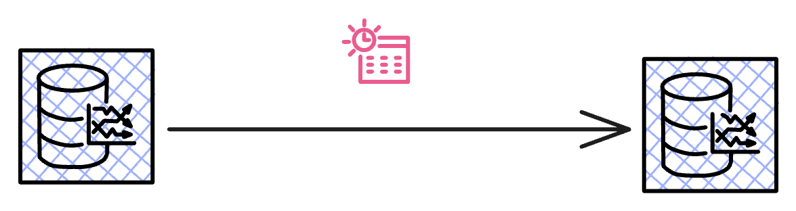
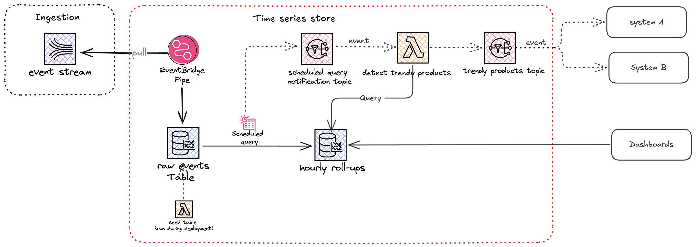

 

 
<strong>Using scheduled queries with Amazon Timestream for LiveAnalytics</strong> 

Complete code for this [Blog post](https://medium.com/@zied-ben-tahar/using-scheduled-queries-with-amazon-timestream-for-liveanalytics-fba47dd4f325)

 

